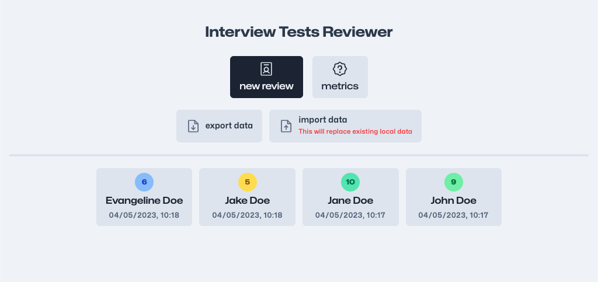
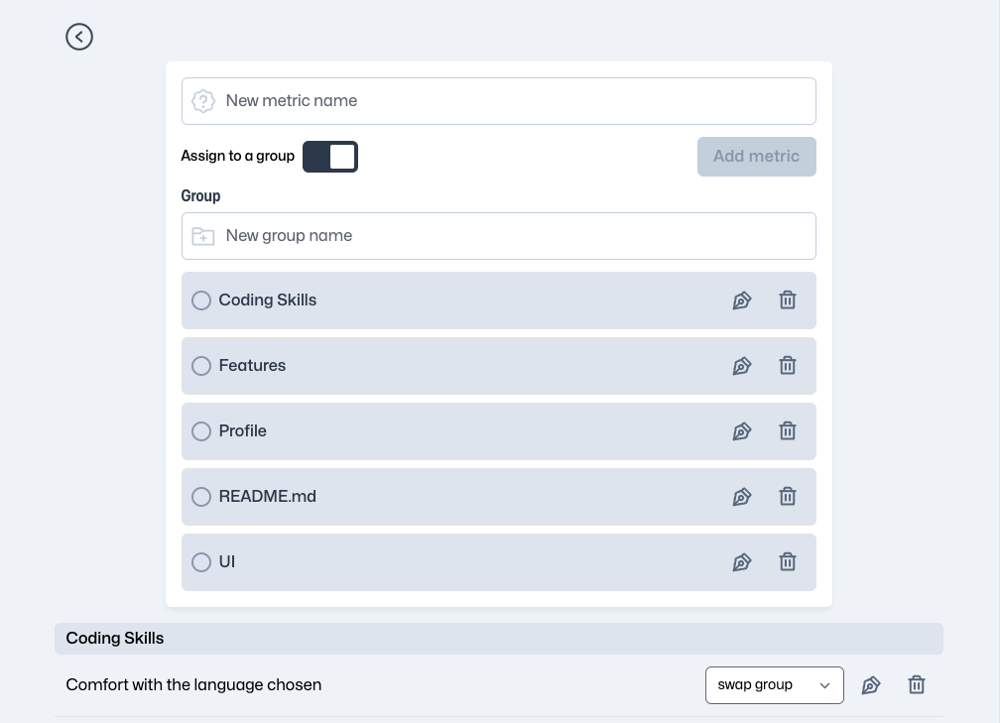
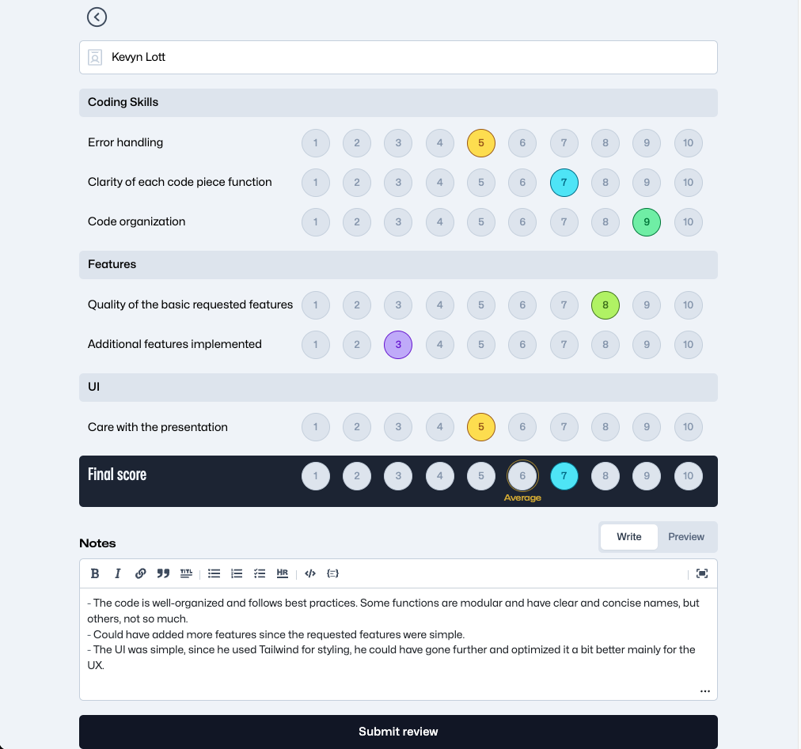
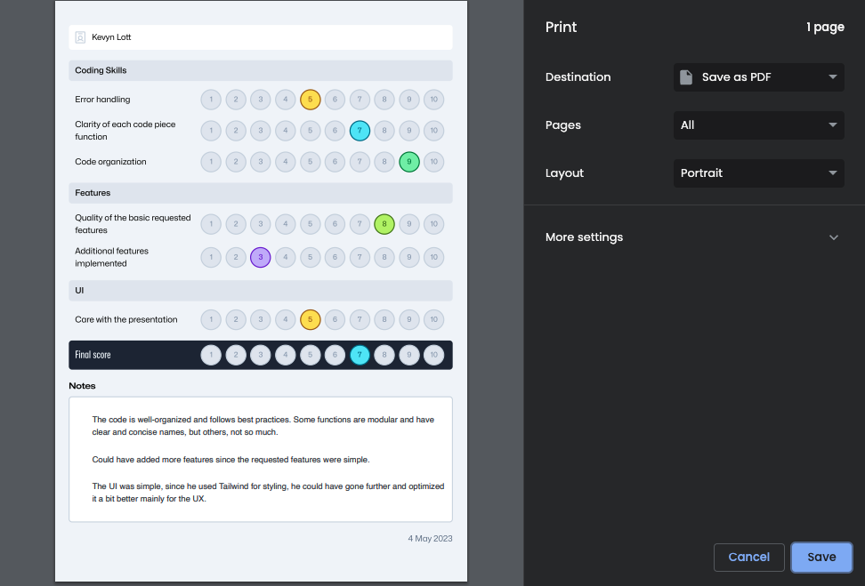

# Interview Tests Reviewer



[](https://ricardopbarbosa.github.io/interview-tests-reviewer)
[](http://makeapullrequest.com)
[](http://www.firsttimersonly.com/)

# Introduction

#### This is a tool to help you review interview tests and keep a record of the previous reviews.

#### This project was born out of necessity. I was reviewing a lot of coding interview tests, and I wanted a place to keep track of the metrics I was using to evaluate the tests, my personal comments at the end, and also to keep a record of the previous reviews.

# Tools Used
* [React](https://reactjs.org/)
* [Vite](https://vitejs.dev/)
* [Typescript](https://www.typescriptlang.org/)
* [TailwindCSS](https://tailwindcss.com/)
* [Zustand](https://github.com/pmndrs/zustand) - State management, your data is stored in **Local Storage**

# Features

## Metric Management
You can sort metrics by groups (or not) for better organization and to try and improve the flow of the review while you scan the code so you spend less time on it.



## Submit Review
Page with the tools needed to make your review.
* Give a score by metric
* Have the average score calculated for you and choose the final score from there
* Add the necessary notes (markdown style & preview the final result)
* Save it



## Export Review
After submitting, you can export the review in PDF or print it in the "Save PDF" button you will see on top.
This way you can send the review to whomever you need to send it.



# Run it locally

```sh
  # Clone this repository
  $ git clone https://github.com/RicardoPBarbosa/interview-tests-reviewer.git

  # Go into the repository
  $ cd interview-tests-reviewer

  # Install dependencies
  $ npm i

  # Run the app
  $ npm run dev
```

# Support

<a href="https://www.buymeacoffee.com/ricardopbarbosa"></a>

# License
MIT